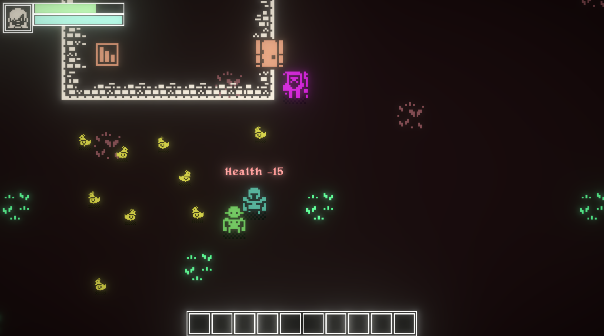

# OBIDOS LEGEND KIT

This is a series of premade scripts intended for kit bashing of quick game development experiments for the Epic-WE Óbidos Jam #4 - Legends.
Created by [Diogo de Andrade] for [Licenciatura em Videojogos][lv] da [Universidade Lusófona de Humanidades e Tecnologias][ULHT] in Lisbon.

# Installation

## Requirements:

- [Unity 6.0.47](https://unity.com/download)
- [VS Code](https://code.visualstudio.com/download)

## How to install

- Clone repository or download ZIP and you're ready to go!
- (if you downloaded the ZIP) Extract project to a directory
- Open Unity Hub, select "Add" => "Project From Disk" and select the directory where the repository was cloned or the ZIP was extracted to
- Open the scene "SampleGame", under the scenes directory and check it out
- Open (or create a copy) of the "MainGame" scene, under the scenes directory and start working on your game!
- Have fun!

# Documentation

There's no documentation yet, but everything has custom editors, which display information on what each thing is doing (dynamically, depending on options selected):

In this image, we can see a bit of the inspector of a normal object. There's the normal Unity components (Sprite Renderer, Rigidbody, Collider), and then we have 
several Okapi Kit components (identifiable by the large title). We have a movement script (rotation movement), an hypertag (allows to define what this object is, usefull to identify objects in collisions or
as targets for operations), we have a collision Trigger (with the text that explains when it triggers,
and what happens), and finally we have several Action scripts (used by the Triggers), that also explain what they're doing.

There's also some icons on the Hierarchy view, indicating which type of Okapi object that objects has:

Placing the mouse cursor on top of any of the icons will display additional information. For example, here we placed the
cursor on top of the Trigger icon (blue dot) on the Player object and we can see all the triggers that it has.

# Licenses

* All source code by Diogo Andrade is licensed under the [MIT] license.
* Font "Alagard" by [Hewett Tsoi]
* 1-Bit Pack by [KenneyNL], licensed under [CC0]
* Gems by [Winternaut], licensed under [CC0]
* Editor icons from [FlatIcon]
* [NaughtyAttributes] by Denis Rizov, available through the MIT license.

# Metadata

* Autor: [Diogo Andrade]

[Diogo Andrade]:https://github.com/DiogoDeAndrade
[NaughtyAttributes]:https://github.com/dbrizov/NaughtyAttributes
[ULHT]:https://www.ulusofona.pt/
[lv]:https://www.ulusofona.pt/licenciatura/videojogos
[Vic Fieger]:http://www.vicfieger.com/
[Hewett Tsoi]:https://www.dafont.com/pt/profile.php?user=698002
[Zealex]:https://opengameart.org/users/zealex
[Pavel Kutejnikov]:https://opengameart.org/users/kutejnikov
[Clear_code]:https://opengameart.org/users/clearcode
[mieki256]:https://opengameart.org/users/mieki256
[SCaydi]:https://opengameart.org/users/scaydi
[Joshua Robertson]:https://opengameart.org/users/jrob774
[Master484]:http://m484games.ucoz.com/
[Warspawn]:https://opengameart.org/users/warspawn
[pansapiens]:https://opengameart.org/users/pansapiens
[rileygombart]:https://opengameart.org/users/rileygombart
[chabull]:https://opengameart.org/users/chabull
[IMakeGames]:http://www.imake-games.com/
[Winternaut]:https://opengameart.org/users/winternaut
[SketchyLogic]:https://opengameart.org/users/sketchylogic
[CC0]:https://creativecommons.org/publicdomain/zero/1.0/
[CC-BY 3.0]:https://creativecommons.org/licenses/by/3.0/
[CC-BY 4.0]:https://creativecommons.org/licenses/by/4.0/
[MIT]:LICENSE
[FlatIcon]:Flaticon.com
[Midjourney]:https://midjourney.com/
